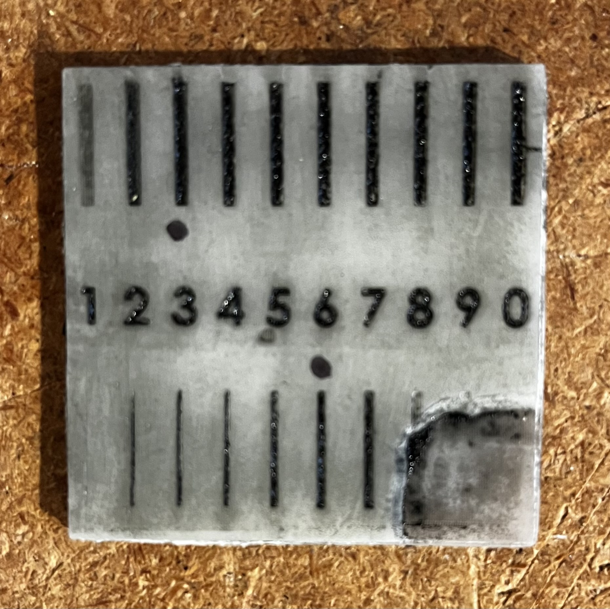

# Laser Curing Powder Coat

# Prismatic Powder Stone Black [Amazon](https://www.amazon.com/gp/product/B00MI5B7UC/)

## Depth & Width Test

* Depths range from 0.1 mm (laebeled "1") to 1.0 mm (labeled "0") 
* Widths on same range

Optimals

* Depth: 0.3 mm
* Min width: 0.6 mm
