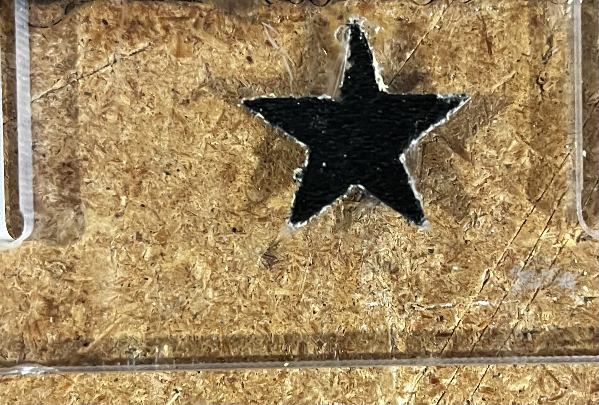

# Laser Curing Powder Coat

# Prismatic Powder Stone Black [Amazon](https://www.amazon.com/gp/product/B00MI5B7UC/)

## Depth & Width Test

* Depths range from 0.1 mm (laebeled "1") to 1.0 mm (labeled "0") 
* Widths on same range

Optimals

* Depth: 0.3 mm
* Min width: 0.6 mm
* Laser: 1000 mm/s, 30% power

## Tape Test

* Used 2x layers of Scotch® Exterior Surface Painter’s Tape 2097.  This is a plastic tape.
* Attempted to laser cut the star image.  Even with multiple passes (800 mm/s, 80% power) did not get fully clean cut.
* Filled with powder coat & cured.
* Removed tape.  Did not get really clean edges due to poor laser cut of plastic tape.
* Laser us 405 nm blue laser.  Cannot cut blue painters tape.

