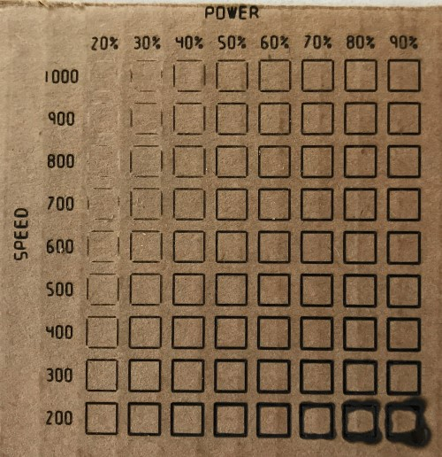

# Laser Speed & Power Setting Optimization

|||
|-|-|
|   | This page provides speed and power setting optimization test results for the Sainsmart 5.5W laser on a variety of materials.  Test patterns were generated with the Python [test pattern G-Code generator](https://github.com/doug-harriman/gcode-utilities/blob/main/gcode_doc.py).  Images for all tests are stored in the [speed-power-images](speed-power-images/) directory.  Results that have been analyzed are in the table below. |

| Material & Image Link | Vector Outline Power/Speed | Vector Infill Power/Speed | Notes |
| :-------------------- | :------------------: | :-----------------: | :---- |
| [J-Tech Photonics Laser Shielding](speed-power-images/acrylic-J-Tech-Photonics-Orange-Laser-Shielding.jpg) | 60% / 800 | 40% / 800 | [Purchase](https://jtechphotonics.com/?product=445nm-laser-shielding) |
| [Acrylic, Extruded, Clear](speed-power-images/acrylic-extruded-clear.jpg)| TBD | TBD | Coated with water washable [Black Crayola Tempera Paint](https://www.amazon.com/gp/product/B0000AQMT6) first | 
